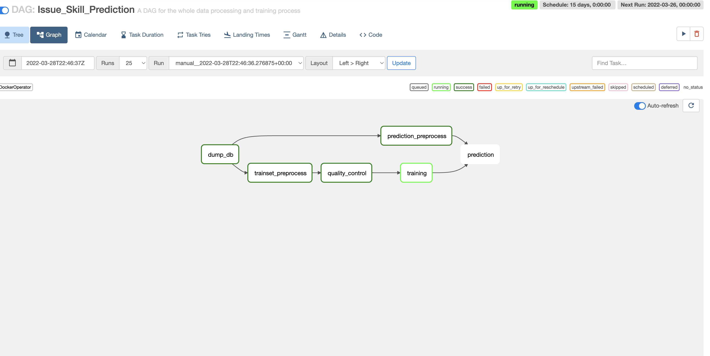
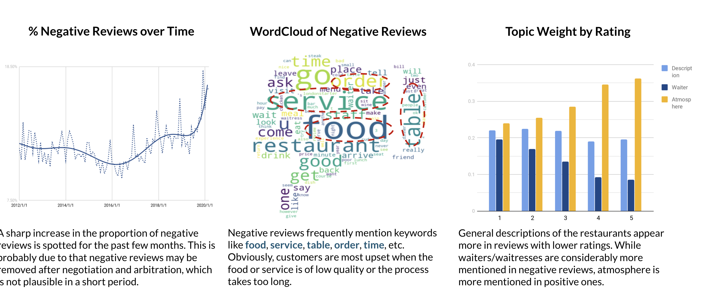

# Portfolio

-------
## Data Engineering
### [Airflow ELT example DAG](https://github.com/dragonlee97/ELT-Pipeline)
- Stacks: Python, SQL, Airflow, AWS Redshift & S3, github actions, jinja
- I summarize and keep updating data engineering good practices in this example dag

### [Data Modelling](https://github.com/dragonlee97/Carpooling)
- Data modelling exercise of both OLTP and OLAP 

## Data Science Projects
### [LinkedIN profile classification engine](/pdf/linkedin_project.pdf)
- Stacks: Python, Docker, REST API, Airflow, AWS, Postgres

### [App icon causal analysis](https://github.com/dragonlee97/App-icon)
- Algos & Techniques: OCR, Mask R-CNN, Propensity Score Matching
- [View Paper](/pdf/Delong_LI_Research_Paper.pdf) 

### [Rebranding for Bokan Restaurant](https://github.com/dragonlee97/Capgemini_DataCamp2020_Group3)
- Algos & Tech: LDA, Word2vec,TF-IDF

-------
## BI dashboards
### [My PowerBI Gallery](https://app.powerbi.com/view?r=eyJrIjoiZjhhNmUwYjctZGFlMi00ZGM4LWFlODItNzhhNDBiYTdlYmM1IiwidCI6ImViNWZjMGY0LTIxNjEtNDBkOC04NDkyLTUxNTk0MjQ0OTc5MyIsImMiOjEwfQ%3D%3D)

---

Page template forked from <a href="https://github.com/evanca/quick-portfolio">evanca</a>

<!-- Remove above link if you don't want to attibute -->
